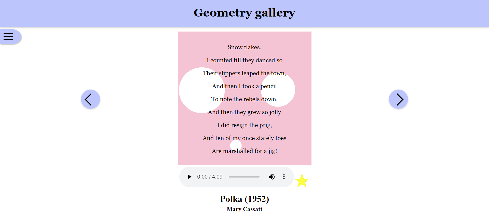
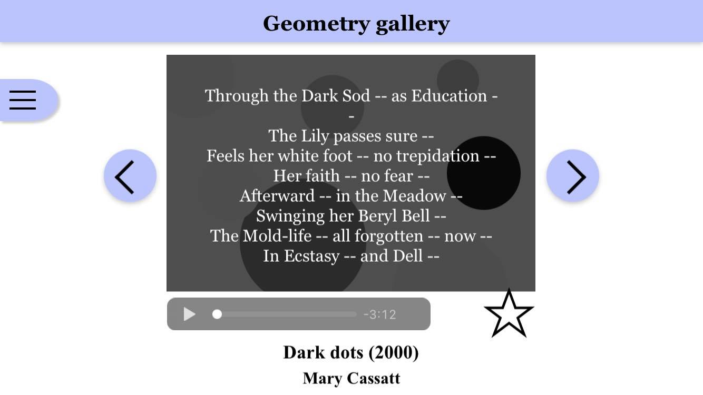

# Exhibition - IT2810 group 20

## Exhibition

The exhibition consists of 9 installations that all include a poem from PoetryDB, audio and animated art created using SVG.

The installations can be filtered by palette, shapes and artists. This is done by selecting the desired filters, and pressing the “Apply filters”-button. If there are no filters corresponding to the selected combination of filters the button will be deactivated. Once the button is pressed, the menu will close, and installations fitting the parameters will be displayed.

Additionally installations can be saved as favorites, and removed later. If the user has any favorites, it can choose to only display these by pressing the corresponding button in the menu. However, we decided not to combine this with the other filtering functionality, as we consider favorites to be a seperate filter. The styling of the star button was inspired by [this](https://css-tricks.com/star-ratings/).

## React

This project is written in React, with TypeScript. To better deal with the installations and its properties, we introduced the interface Installation. This was used instead of the Object type, which also made the code more readable and clear. The project consists of both class- and functional components, where state was handled through setState and hooks, respectively. Additionally, we created a context called “installationIndex” to keep track of which installation is displayed. The reason this is a context instead of state in the Carousel-component is that several files through the app need to change its value. To learn about the context API the [React docs](https://reactjs.org/docs/context.html) and [this tutorial](https://www.carlrippon.com/react-context-with-typescript-p1) was used.

To propagate changes to components after they were rendered, we used componentDidUpdate in the class components and useEffect in the functional components. An example of this is the color of the star, which needs to wait for an installation to be rendered before knowing whether it is a favorite or not.
ContextBasedApp returns the App component as a context provider and is at the top of the component hierarchy. App is the component which connects everything in the application. The App component sends functions as properties to it’s child components, which is used to make App re-render. To understand this concept, we read [this article](https://www.pluralsight.com/guides/how-to-pass-props-object-from-child-component-to-parent-component).

## SVG

The art in the installations are saved as an array with classes from shapes.tsx. The shape-classes accept parameters to specify properties like id, coordinates, and color. When the create<shape\>() function is called the components return SVG-objects, which can then be styled and animated in the associated installation’s CSS-file.

## Ajax

The fetch() method was used to retrieve the specified poem in JSON format from PoetryDB, which was then used to update the state of the Poetry component. To avoid complications with asynchronous functions, the then() function was used. The URLs all follow this structure: "https://poetrydb.org/title/<poemTitle\>/lines.json".

The audio was implemented using the HTML audio-tag, and downloaded from [fesliyanstudios](https://www.fesliyanstudios.com) and [soundclick](https://www.soundclick.com). Soundclick allows you to download music for educational purposes like this, and fesliyanstudios allows the use of their music and sound effects in any non-commercial project. We chose to store the music with Google Drive and used a URL in the audio-tag to play the music, as explained [here](https://stackoverflow.com/questions/32392072/how-to-play-google-drive-mp3-file-using-html-audio-tag).

## HTML Web Storage

LocalStorage was used to keep track of the user’s favorites. [This tutorial](https://egghead.io/lessons/react-store-values-in-localstorage-with-the-react-useeffect-hook) was used to get an overview of localStorage with hooks. Later, we converted the component using localStorage to a class, but the approach was still inspired by the tutorial.

We used session storage to save which installation is currently displayed when the browser refreshes. To make sure that the installation number is saved when you change the installation, we updated sessionStorage in Carousel’s componentDidUpdate(). Additionally we save the chosen filters to sessionStorage as “notAppliedTags” whenever the user interacts with a filter-checkbox. When the user clicks the “Apply filters”-button - and the chosen combination of filters would result in at least one installation - the selected filters are saved as “tags”.

The JSON methods stringify() and parse() were used to handle storing an array in both web storages, combined with the methods setItem() and getItem().

## Responsive Web Design

We decided that on wide screens or screens in landscape mode, the menu is extended from the left, and on thinner screens in portrait mode the menu extends from the top. We chose not to have the menu extend from the top on wide screens in portrait mode because we found that it is more common to have menus on the side on e.g. OneNote and Slack on tablets. We also moved the arrows used to change between installations when the width shrinks. To do this we used media-queries to specify when the different layouts should be used, and we changed the grid-template-areas to move items around. To give the menu a good height we used viewport (vh), and changed the values when the menu moved to the top of the page.

Our installations’ SVG figures were positioned using percentage in CSS, except for installations that used triangles, since this class relies on the “points” attribute, which cannot be described in percentages. Some shapes’ sizes are also in percentage.

## Node.js and NPM

The project is bootstrapped with [Create React App](https://github.com/facebook/create-react-app), using the TypeScript template. Since we developed locally, these commands have been used:

##### npm install

##### npm start

##### npm test

## Testing

We have created a snapshot test of our application that will only pass if the component hierarchy is unchanged. If we make changes to the component hierarchy in the future that we did not intend to do, this test will catch that. To run the test, type npm test.

Our application has been tested in Google Chrome, Edge and Firefox. The only differences we found was that the checkboxes and audio controller have different appearances in the different browsers, and the blur covering most of the page when the menu is open does not work in Firefox (but there is still a transparent white box covering the page). However neither of these things affect the user experience.

We checked that the application looked good on different screen sizes using the device toolbar in the console, and also checked on our own computers, pads and phones as well, through GitPod. The website looked good on computers, pads, iPhone 7 and Motorola One Vision.

This is what the application looked like on our different devices: (Click on an image to expand it)

Application on computer:

Application on computer with open menu:

Application on iPad in portrait mode with an open menu:

Application on phone in portrait mode:

Application on phone in portrait mode with open menu:

Application on phone in landscape mode:

Application on phone in landscape mode with open menu:

## Issues and git

Issues in GitLab were used to keep track of which tasks were available, ongoing and done. These were visualized through using the Issue Board functionality, with an additional column, “Code Review” including issues with an open merge request. We also had the policy that each request had to be reviewed by one other person and the convention that all branches correspond to an issue.

## Sources

- https://css-tricks.com/animating-svg-css/
- https://css-tricks.com/guide-svg-animations-smil/
- https://css-tricks.com/star-ratings/
- https://stackoverflow.com/questions/32392072/how-to-play-google-drive-mp3-file-using-html-audio-tag
- https://css-tricks.com/snippets/css/a-guide-to-flexbox/
- https://www.soundclick.com/search/default.cfm?searchterm=kiss%20the%20rain
- https://stackoverflow.com/questions/38892672/react-why-child-component-doesnt-update-when-prop-changes
- https://www.telerik.com/blogs/how-to-show-and-hide-elements-in-react
- https://stackoverflow.com/questions/18611195/x-close-button-only-using-css
- https://developer.mozilla.org/en-US/docs/Web/API/Window/localStorage
- https://www.pluralsight.com/guides/how-to-pass-props-object-from-child-component-to-parent-component
- https://egghead.io/lessons/react-store-values-in-localstorage-with-the-react-useeffect-hook

The tooltip was inspired by [W3Schools](https://www.w3schools.com/howto/howto_css_tooltip.asp).

In general, the [React docs](https://reactjs.org/docs/getting-started.html) were used a lot to understand different concepts, like [React Context](https://reactjs.org/docs/context.html), and [Hooks](https://reactjs.org/docs/hooks-effect.html).
